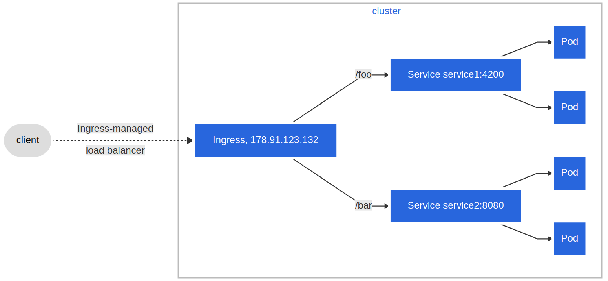

# With Ingress, users do not connect directly to a Service. Users reach the Ingress endpoint, and, from there, the request is forwarded to the desired Service. You can see an example of a sample Ingress definition below:
```
apiVersion: networking.k8s.io/v1 
kind: Ingress
metadata:
  name: virtual-host-ingress
  namespace: default
spec:
  rules:
  - host: blue.example.com
    http:
      paths:
      - backend:
          service:
            name: webserver-blue-svc
            port:
              number: 80
        path: /
        pathType: ImplementationSpecific
  - host: green.example.com
    http:
      paths:
      - backend:
          service:
            name: webserver-green-svc
            port:
              number: 80
        path: /
        pathType: ImplementationSpecific
```
## In the example above, user requests to both blue.example.com and green.example.com would go to the same Ingress endpoint, and, from there, they would be forwarded to webserver-blue-svc, and webserver-green-svc, respectively. This is an example of a Name-Based Virtual Hosting Ingress rule. 


## We can also define Fanout Ingress rules, when requests to example.com/blue and example.com/green would be forwarded to webserver-blue-svc and webserver-green-svc, respectively:
```
apiVersion: networking.k8s.io/v1
kind: Ingress
metadata:
  name: fan-out-ingress
  namespace: default
spec:
  rules:
  - host: example.com
    http:
      paths:
      - path: /blue
        backend:
          service:
            name: webserver-blue-svc
            port:
              number: 80
        pathType: ImplementationSpecific
      - path: /green
        backend:
          service:
            name: webserver-green-svc
            port:
              number: 80
        pathType: ImplementationSpecific
```


## The Ingress resource does not do any request forwarding by itself, it merely accepts the definitions of traffic routing rules. The ingress is fulfilled by an Ingress Controller, which is a reverse proxy responsible for traffic routing based on rules defined in the Ingress resource

# An Ingress Controller is an application watching the Master Node's API server for changes in the Ingress resources and updates the Layer 7 Load Balancer accordingly. Ingress Controllers are also know as Controllers, Ingress Proxy, Service Proxy, Revers Proxy, etc. Kubernetes supports an array of Ingress Controllers, and, if needed, we can also build our own. GCE L7 Load Balancer Controller and Nginx Ingress Controller are commonly used Ingress Controllers. Other controllers are Contour, HAProxy Ingress, Istio, Kong, Traefik, etc.

```
minikube addons enable ingress
```